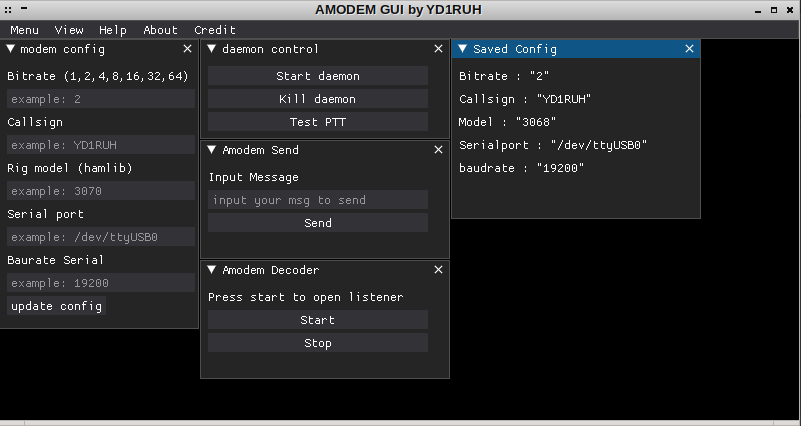

# amodemGUI
Enhance python audio modem with GUI dearpygui.

## Requirement
- Linux Operating System (64-bit)
- python3 : `apt install python3`
- python amodem : `pip3 install amodem`
- terminator : `apt install terminator`
- DearPyGUI : `pip3 install dearpygui`
- hamlib : [Installation guide](https://github.com/Hamlib/Hamlib)

## How To Use
Open terminal, then run `./amodemGUI`
